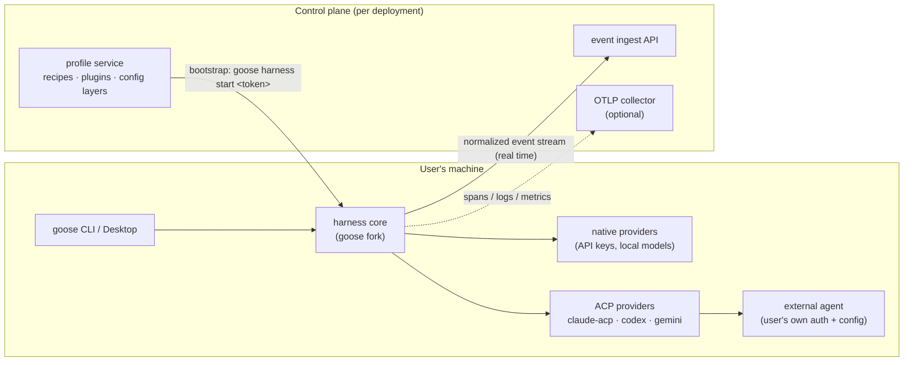
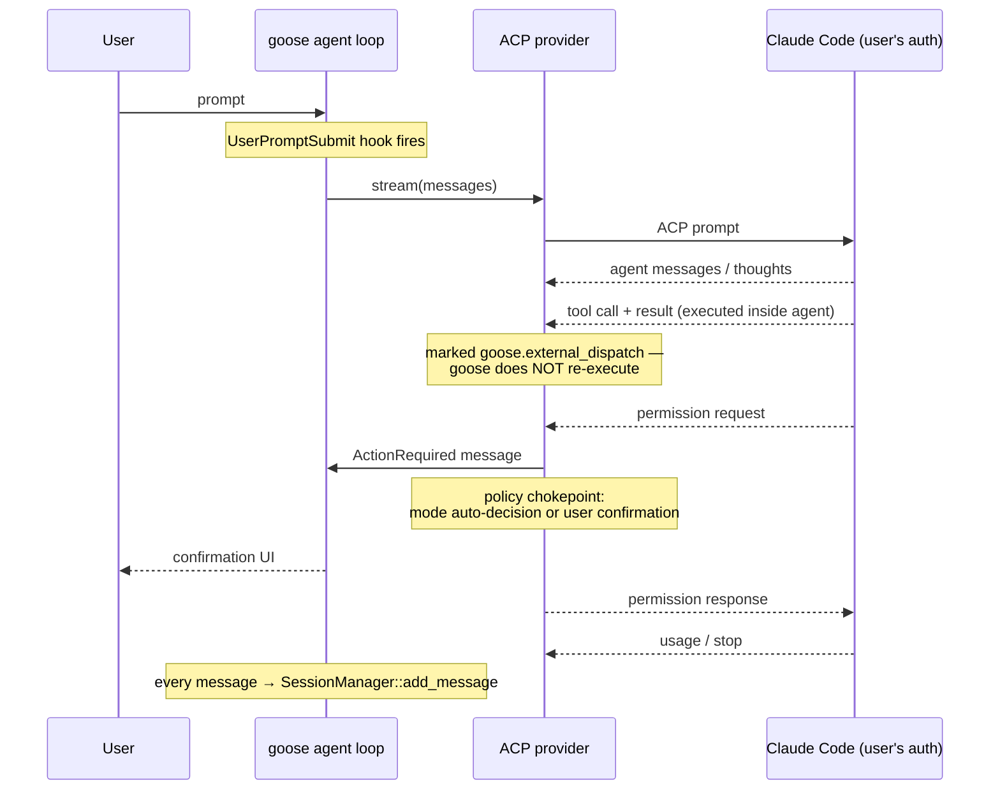

# Agent Harness Architecture

**Status:** v0 implemented · 2026-08-19 (see §9 for status per workstream)
**Base:** fork of [`aaif-goose/goose`](https://github.com/aaif-goose/goose) at v1.47.0 (`9f941fbfc`)

---

## 1. What this is

A general-purpose **agent harness**: a person brings their own coding agent (their Claude Code subscription, their MCPs, their config), and this layer sits in the client seat adding four things the agent alone doesn't provide:

1. **Identity** — every session is bound to a person and a context (exam token, SSO principal)
2. **Observability** — a normalized, real-time event stream of prompts, agent output, tool calls, and permission decisions
3. **Policy** — allow/deny/require-approval rules over what the agent may do
4. **Provisioning** — config, extensions, and workspaces pushed into sessions from a control plane

Concrete use cases are **profiles** of the same core, not separate products:

| Profile | What it configures |
|---|---|
| **Exam** | Workspace bootstrap from an exam token, exhaustive logging streamed to the exam platform's ingest API, submission flow, locked settings |
| **Org** | SSO-bound identity, org-blessed extensions and skills, policy rules (tool deny-lists, redaction), usage/cost telemetry to the org's warehouse |
| *(future)* | Research evals, vendor audits, onboarding sandboxes — anything that is "wrap an agent, watch and shape what it does" |

**Design rule:** the core stays use-case-agnostic. A profile is a config bundle (plus at most a small extension). If exam logic wants to live in core, that's the smell to catch.

The interview platform itself is a **separate system** that consumes this harness through its ingest API. This repo is only the tooling.

## 2. Why intercept at the agent-client layer

Three candidate interception points were considered:

| Approach | Auth story | What you see | Friction |
|---|---|---|---|
| **API proxy** (`ANTHROPIC_BASE_URL` → gateway) | Requires API-key mode; subscription OAuth doesn't redirect | Raw model traffic: full message history, system prompt, tokens | One env var, but forces users off their subscription; per-tool quirks |
| **Client-side hooks** (Claude Code hooks/OTel) | User's own | Lifecycle events | Tool-specific; logs are user-editable |
| **ACP client (chosen)** — goose drives the agent via the [Agent Client Protocol](https://agentclientprotocol.com) | **User's existing subscription** (`claude` CLI login, etc.) | Prompts, agent messages, thoughts, tool calls/results, permission requests, usage | One binary; user's agent config (CLAUDE.md, MCPs) carries over; UI is goose's, not the agent's own TUI |

The ACP approach wins on friction and generality: goose's `claude-acp` provider already wraps Claude Code, and the same protocol covers Codex CLI, Gemini CLI, and other ACP-registry agents. Goose's **native providers** (direct API with org keys, local models) remain available through the same session machinery, so both "bring your own agent" and "org-issued model access" flow through one pipeline.

The API proxy stays in the back pocket as an additive option for org deployments that want server-side, tamper-proof capture of *non-goose* usage. It is not on the critical path.

### Trust model

We **observe process, we don't enforce integrity**. A candidate/employee can always consult another model out-of-band; only a controlled environment (VM, egress rules) prevents that, and that is explicitly out of scope. Consequences:

- Logs originate client-side → **stream events to the backend in real time** during the session. Casual tampering (editing a log file before upload) becomes ineffective; sophisticated tampering (patching the binary) is accepted as out of scope.
- Evaluation is based on the logged process **plus the final artifact** (e.g. submitted diff), which is independently verifiable.

## 3. System overview



The fork adds five things to goose (detailed in §6): a **session identity** binding, an **ingest sink**, an **ACP policy handler**, a **bootstrap command**, and **config lockdown**. Everything else reuses machinery goose already has.

## 4. What goose already provides

Verified against the codebase at `9f941fbfc`. This is the reuse map — each row is a capability the harness needs, and where it already exists.

| Harness capability | Goose mechanism | Where |
|---|---|---|
| Unified message pipeline (both native & ACP paths) | ACP providers implement the standard `Provider` trait, so external-agent output flows through the same agent loop as native providers | `crates/goose/src/acp/provider.rs` |
| Durable session record | Every message funnels through `SessionManager::add_message` into local SQLite (`sessions.db`, WAL) | `crates/goose/src/session/session_manager.rs:443` |
| Live event stream | `AgentEvent` enum: `Message`, `Usage`, `MessageUsage`, `McpNotification`, `HistoryReplaced` | `crates/goose-agent/src/events.rs` |
| Lifecycle hooks | Open-plugins hooks spec: `PreToolUse` (blocking, can deny), `PostToolUse(Failure)`, `SessionStart/End`, `UserPromptSubmit`, `Before/AfterShellExecution`, `BeforeReadFile`, `AfterFileEdit`, `Stop`. Command-type hooks, JSON context on stdin | `crates/goose/src/hooks/mod.rs`; emitted throughout `crates/goose/src/agents/agent.rs` |
| Pluggable tool policy | `ToolInspector` trait → `Allow / Deny / RequireApproval`; registered inspectors: Security, Egress, Adversary, Permission, Repetition | `crates/goose/src/tool_inspection.rs:34`; registration `crates/goose/src/agents/agent.rs:726` |
| Approval modes & memory | `GooseMode` (`auto` / `smart-approve` / `approve` / `chat`), `ToolPermissionStore` for remembered decisions | `crates/goose/src/permission/` |
| Telemetry export | OTLP spans/logs/metrics via standard `OTEL_EXPORTER_OTLP_*` env vars (http/protobuf only); `gen_ai.*` semantics incl. token usage and message payloads (`gen_ai.output.messages`) | `crates/goose/src/otel/otlp.rs`; `crates/goose/src/agents/gen_ai_telemetry.rs`; recording at `crates/goose/src/agents/reply_parts.rs:563` |
| Layered managed config | Merged stack: `/etc/goose/config.yaml` (system) + user `config.yaml` + env overrides, deep merge | `crates/goose/src/config/base.rs:131-162,290` |
| Session templates | Recipes: instructions, starting prompt, extensions, model settings, parameters, response JSON schema, sub-recipes, retry | `crates/goose/src/recipe/mod.rs:42` |
| Distribution unit | Plugins (open-plugins format, user/project scope) carrying hooks + MCP servers | `crates/goose/src/plugins/discovery.rs` |

## 5. Event flow — the two paths

### 5.1 Native provider path

Goose runs the agent loop itself: it calls the model, dispatches tool calls to extensions (MCP servers), and executes them locally. **Everything fires**: hooks, `ToolInspector` pipeline, permission modes, and persistence.

### 5.2 ACP path (external agent, e.g. Claude Code)

The external agent runs its own loop. Goose sends the prompt over ACP and receives session updates, which the ACP provider translates into ordinary goose `Message`s:



**The critical asymmetry:** tool calls executed inside the external agent carry the `goose.external_dispatch` marker (`crates/goose-provider-types/src/conversation/message.rs:158`) and are skipped by goose's dispatcher (`crates/goose/src/agents/reply_parts.rs:663,702` via `was_executed_externally`). Therefore on the ACP path:

- ✅ **Logging is complete** — external tool calls and results still arrive as messages and hit `add_message`. The ingest sink sees everything on both paths.
- ❌ **`PreToolUse` hooks and `ToolInspector`s do not run** for externally executed tools. The enforcement chokepoint on this path is the **permission-request handler** (`crates/goose/src/acp/provider.rs:766-800`): the external agent's permission requests route through goose's confirmation flow, with mode-based auto-decisions (`permission_decision_from_mode`). What the external agent *asks about* is governed by the `mode_mapping: HashMap<GooseMode, Vec<String>>` passed in `AcpProviderConfig`.

Known ACP limitations to design around (from goose docs): no session fork/resume, and ACP session IDs don't align with goose session IDs — another reason the harness stitches its **own** session ID through all events (§6.2).

## 6. What the fork builds

Five workstreams, ordered roughly by dependency.

### 6.1 Ingest sink

A `Sink` trait with fan-out, tapped at `SessionManager::add_message` (single chokepoint, both paths, all frontends) plus session lifecycle and permission-decision events:

```
trait EventSink {
    async fn emit(&self, event: HarnessEvent);   // fire-and-forget, buffered, never blocks the loop
}
```

- **Normalized event schema** (versioned): `session_start`, `prompt`, `agent_message`, `tool_call`, `tool_result`, `permission_request`, `permission_decision`, `usage`, `artifact`, `session_end`. Each event carries `harness_session_id`, `principal`, `profile`, `seq`, `ts`.
- **Sinks:** HTTP ingest (batched, retried, disk-buffered for offline), local JSONL (always on — the durable local copy), OTLP (reuse existing exporter where possible).
- Sink failures must **never** stall or break the agent loop; buffer and retry. For exam mode, the session UI surfaces "recording" state so a broken sink is visible, not silent.

*Open spike:* validate whether the existing OTLP `gen_ai.*` export already carries complete-enough payloads — if yes, the HTTP sink can be thin and the collector does the heavy lifting.

### 6.2 Session identity

- `harness_session_id` (UUID, minted at bootstrap) + `principal` (exam token subject or SSO identity) stored in session metadata and stamped on every event.
- Solves the ACP/goose session-ID misalignment by making neither the source of truth.
- Exam tokens are short-lived, single-session credentials issued by the platform; the ingest API authenticates events with them.

### 6.3 ACP policy handler

- Extend the permission-request path in `acp/provider.rs` to consult profile policy **before** mode-based auto-decisions: deny-listed tools are refused (and logged as `permission_decision{decision:"policy_deny"}`), everything else falls through to existing behavior.
- Pin `GooseMode` and `mode_mapping` from the locked profile config so users can't silently flip the external agent to full-auto if the profile forbids it (or, in exam mode, can't disable the asking that generates the permission record).
- Native path needs no new mechanism: ship an additional `ToolInspector` fed by profile policy.

### 6.4 Bootstrap command

`goose harness start <token-or-profile>`:

1. Resolve token → fetch profile from control plane (recipe + plugin pack + config layer + sink endpoints)
2. Materialize workspace (exam: clone the exercise repo; org: no-op)
3. Mint `harness_session_id`, emit `session_start`
4. Launch the session with the profile's recipe

Exam mode adds `goose harness submit`: final `git diff`/archive shipped as an `artifact` event, then `session_end`. The recipe/plugin mechanisms mean most of this is assembly, not new machinery.

### 6.5 Config lockdown

Profile-critical keys (sink endpoints, mode, policy, telemetry) must not be user-overridable. Today's precedence is env > user config > system config — the wrong direction for managed settings. Add a **locked layer** (fetched at bootstrap, integrity-checked) that wins over user config and env for an allow-listed set of keys. Everything outside that set keeps normal precedence so personal config still works.

## 7. Profiles as artifacts

A profile is data, served by the control plane:

```yaml
profile:
  id: exam/backend-2026-q3
  recipe: ...            # instructions, extensions, model settings
  plugins: [...]         # hook packs, MCP servers (exam submission ext, org tools)
  config_locked:         # keys pinned via the locked layer
    GOOSE_MODE: approve
    harness.sinks: [{type: http, endpoint: ...}]
  policy:
    tools:
      deny: [...]
      require_approval: [...]
  workspace:             # exam only
    repo: ...
```

Exam and org differ **only** in profile content and control-plane behavior. Nothing in the fork branches on "exam" vs "org".

## 8. Open questions

1. **OTLP-only vs custom sink** — decided by spike (§6.1). Leaning custom HTTP sink for the exam path (ordering, acks, artifact upload) with OTLP as the org-telemetry option.
2. **Upstream drift** — goose moves fast (`upstream` remote retained). Keep the fork's diff small and additive: new crates/modules where possible, minimal edits to `agent.rs`/`session_manager.rs`/`acp/provider.rs`. Candidate long-term move: upstream a generic sink/tap trait.
3. **Desktop vs CLI first** — CLI first (exam candidates and CI both live there); desktop inherits the core tap for free since it consumes the same crates.
4. **Redaction** — org profiles will want secret-scrubbing before events leave the machine. Likely a sink-side filter stage; needs design.
5. **Multi-agent parity** — claude-acp first; codex/gemini adapters after the event schema stabilizes, verifying each surfaces tool calls and permission requests with comparable fidelity.

## 9. Implementation status (v0)

Implemented in `crates/goose/src/harness/` plus `crates/goose-cli/src/commands/harness.rs`:

| Workstream | Status | Where |
|---|---|---|
| Ingest sink — JSONL always-on + batched/retried HTTP ingest, non-blocking pump | ✅ | `harness/sink.rs` |
| Event schema — envelope + per-content-block derivation, payload caps | ✅ | `harness/events.rs` |
| Tap — every persisted message + usage metrics, both paths | ✅ | `session/session_manager.rs` (`add_message`, `record_usage_metrics`) |
| Session identity — `harness_session_id` + principal on every event; context at `.goose-harness/session.json`, discovered via `GOOSE_HARNESS_CONTEXT` or ancestor walk | ✅ | `harness/mod.rs` |
| Policy, native path — `HarnessPolicyInspector` (runs first in the inspector pipeline) | ✅ | `harness/policy.rs`, registered in `agents/agent.rs` |
| Policy, ACP path — deny / force-approval in the permission-request handler + `permission_decision` events for mode and user decisions | ✅ | `acp/provider.rs` |
| Bootstrap — `goose harness start` (profile fetch, workspace clone, locked config, child session launch), `submit` (diff artifact + session end), `status` | ✅ | `goose-cli/commands/harness.rs` |
| Config lockdown | ✅ v0 (profile `config_locked` applied as process env, which tops goose's config precedence and is inherited by the session child process) | `commands/harness.rs` |
| Profiles | ✅ (YAML from path or URL; examples in `examples/harness-profiles/`) | `harness/profile.rs` |

### Usage

```bash
# Exam candidate
goose harness start --profile https://exam.example.com/profiles/backend-q3 \
  --principal candidate@example.com --token <session-token>
# … work in the launched session; everything streams to ingest + .goose-harness/events.jsonl
goose harness submit

# Org / local trial
goose harness start --profile examples/harness-profiles/org-default.yaml
goose harness status
```

### v0 limitations

- Config lockdown is env-based: it binds goose invocations launched under `harness start` (and any process given `GOOSE_HARNESS_CONTEXT`), but a user running plain `goose` in the workspace gets event capture (context discovery) without the locked env. A config-layer lock is the follow-up.
- `submit` captures `git diff <base_commit>` plus an untracked-file listing; untracked file *contents* are not yet included.
- Remote ingest buffer is bounded (10k events) with drop-oldest under sustained outage; the local JSONL log is never dropped.
- ACP policy matches on permission-request titles (ACP doesn't expose goose tool names); title patterns are honest-agent enforcement, not a security boundary — consistent with the observe-don't-enforce trust model (§2).

## 10. Glossary

| Term | Meaning |
|---|---|
| **ACP** | Agent Client Protocol — JSON-RPC protocol between a client (goose) and an agent (Claude Code, etc.) |
| **External dispatch** | A tool call executed inside the external agent, marked `goose.external_dispatch`, never re-executed by goose |
| **Profile** | A control-plane-served bundle: recipe + plugins + locked config + policy (+ workspace) |
| **Principal** | The identified human behind a session (exam candidate, employee) |
| **Sink** | A destination for the normalized event stream (HTTP ingest, JSONL, OTLP) |
